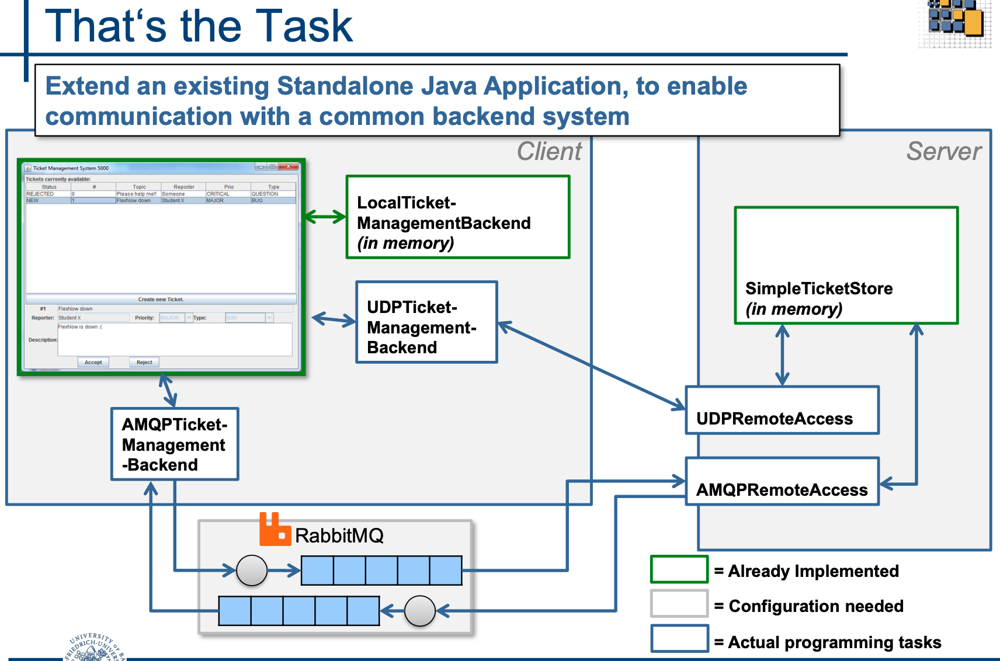
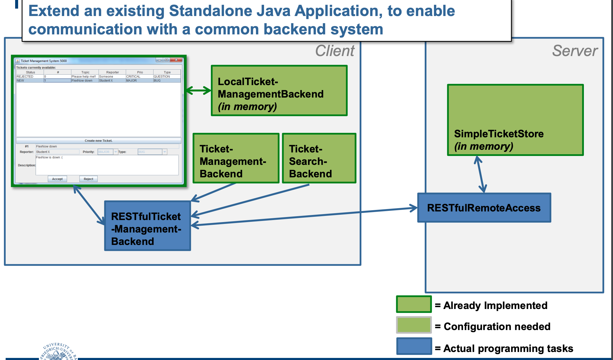

### 🎫 Distributed Systems: Ticket Manager Evolution

This project documents the architectural evolution of a **Ticket Management System** from a basic standalone application to a robust, scalable, and loosely coupled distributed system, fulfilling two sequential assignments for the Distributed Systems course at the University of Bamberg.

Due to academic policy, only the architectural overview and task descriptions are provided.

---

### Phase 1: Communication Protocol Implementation 

**Goal:** Extend the standalone *Ticket Management System 5000* to use a central storage server by implementing communication protocols like UDP and AMQP.

* **UDP Sockets:** Implemented one-way ticket creation, a basic communication protocol for CRUD operations, and an advanced protocol to handle large ticket lists by **splitting and reassembling messages** across multiple packets, accounting for potential incorrect ordering.
* **AMQP (RabbitMQ):** Implemented one-way persistent message delivery, an advanced protocol for receiving replies using **temporary queues**, and an "even more advanced" **Push-API** using an additional Exchange to notify all clients of new/updated tickets.
* **Concurrency:** Ensured the server could handle multiple simultaneous client requests concurrently for both UDP and AMQP protocols.
* **Shared Component:** The `shared` project contained `Ticket` representations used by both client and server.

**Task overview for UDP and AMQP**

---

### Phase 2: RESTful Web Service Implementation 

**Goal:** Refactor the system to a RESTful Web Service architecture for loose coupling and scalability, focusing on advanced API querying capabilities.

#### 1. Architecture & Design

The system transitioned to a **Client-Server architecture** where the client's Swing-GUI consumed a **RESTful Web Service**.

* **Server Component:** Implemented a `RESTfulRemoteAccess` layer to expose the `TicketManager 5000` functionality.
* **Technology:** Used the **Java API for RESTful Web Services (JAX-RS)**, with Jersey as the reference implementation.
* **Data Handling:** Introduced custom transfer classes (`shared` project) with **JAXB annotations** for appropriate conversion between server-side entities and remote transfers.

#### 2. Key Features Implemented

| Category | Feature | Description |
| :--- | :--- | :--- |
| **Basic CRUD** | Create, Retrieve, Update, Delete  | Implemented core functionality using appropriate HTTP verbs and status codes. |
| **API Queries** | Searching and Filtering  | Extended the API to allow searching tickets by **name** and filtering by **type**. |
| **Error Handling** | Robust Responses  | Implemented basic error handling to return proper **HTTP status codes** and **meaningful messages** for client- or server-caused errors. |
| **Concurrency** | Thread Safety | The RESTful server was designed to handle concurrent submissions and modifications from multiple clients, including an optional task to create a **threadsafe `TicketStore` implementation**. |

**Task architectural diagram for REST/JAX-RS**

---

### 🚀 Technical Skills Demonstrated

* **Distributed Systems Fundamentals:** Implementing and comparing low-level (UDP) and message-oriented (AMQP) communication protocols.
* **RESTful API Development:** JAX-RS implementation, proper HTTP verb usage, status codes, and adhering to established design rules.
* **Advanced API Design:** Implementation of searching, filtering, and the crucial **Pagination** concept for scalable resource querying.
* **Concurrency Management:** Designing server-side solutions to handle simultaneous client requests and potential race conditions.
* **Serialization/Deserialization:** Using JAXB annotations and custom transfer classes for data exchange between systems.
* **Interoperability:** Configuring the server to consume/produce **XML (`application/xml`)** and **JSON (`application/json`)** formats.